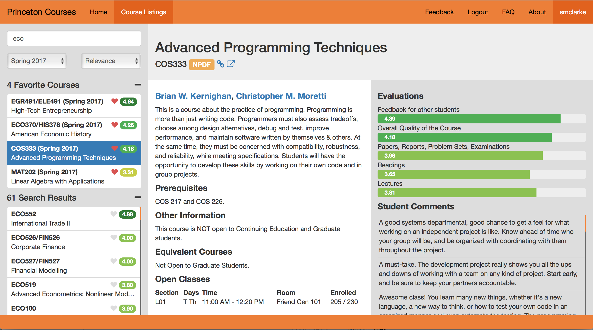

# Princeton Courses
Twice a year, every Princeton student spends hours planning their courses for the following semester. Course selection choices are incredibly important: choosing well can make a semester fun, intellectually stimulating, and exciting, while choosing poorly can result in boredom, academic struggles, and disengagement.

Princeton Courses is the best way to discover and learn about courses offered at Princeton. The website offers users effortless, precise searching and, for every Princeton course, the most comprehensive collection of information about the course’s details, schedule, evaluations, student comments, and history.

**Access Princeton Courses at [princetoncourses.com](https://www.princetoncourses.com).**

A screenshot of Princeton Courses in action.

## Authors
This app was made by Bensu Sicim, Caterina Golner, Kara Bressler, Mel Shu, and [Sebastian Hallum Clarke](http://www.zibity.com) as a project for Princeton's [COS 333](http://www.cs.princeton.edu/courses/archive/spring17/cos333/) in Spring 2017.

The app is currently maintained by the Princeton USG [TigerApps](https://www.tigerapps.org/) committee.

## Install
To install Princeton Courses on your computer or server, follow [these instructions](docs/installation.md).
